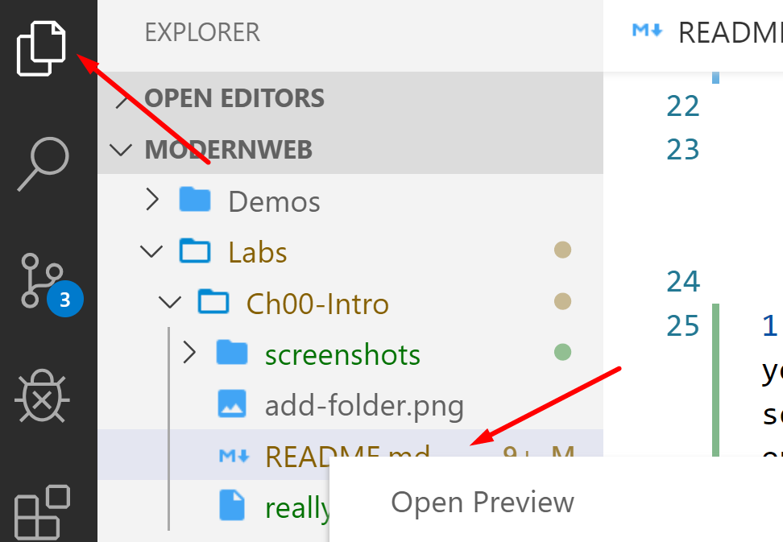
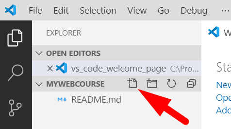

# Chapter 0: Intro

## Objectives

* Practice with markdown files
* Practice with VSCode
* Install VS Code extensions
* Create new local repository used during class
* Commit changes
* Optionally create GitHub repository

## NOTES

* Throughout the course the terms folder and directory are used interchangeable.
* You may see references to Enter key and Return key. These are the same intention, Enter is usually found on Windows and Return on Macs.

Links to content below

[Part 1 - Markdown .md files in Edit & Preview Mode](#part-1---markdown-md-files-in-edit--preview-mode)

[Part 2 - The Course Files](#part-2---the-course-files)

[Part 3 - Local Git Repo](#part-3---create-a-local-git-repo-for-tracking-changes)

[Part 4 - Install VSCode extensions](#part-4-install-vs-code-extensions)

[Part 5 - Create Local Git Repo](#part-5---create-new-mywebcourse-local-repository)

[Part 6 - Using VSCode to commit changes](#part-6---using-vscode-to-commit-and-ignore-changes)

[Part 7 - Use .gitignore to not track changes](#part-7---using-gitignore-to-ignore-changes)

[Part 8- Optionally create GitHub remote repo](#part-8-optional--setup-github-remote-repository)

[Bonus](#bonus)

### **Part 1 - Markdown .md files in Edit & Preview Mode**

    We use markdown files in this class as they are used extensively in the industry with modern web projects.  They are plain text files that end in the extension `.md` and use special characters to indicate the meaning of text and how to display it when used on websites.
    
    On repository sites such as GitHub and Bitbucket a README.md in the root directory describes repositories and how to build and run dynamic projects. If you like to use Reddit you can use markdown to style your posts.
    
    The default mode of VS Code opens `.md` files in EDIT MODE where you see the special characters for formatting. VSCode also offers a PREVIEW MODE so you can more easily read the styled text.

    We will look at multiple ways to open markdown files in PREVIEW MODE in VSCode. You will use these methods for lab exercises and some demos. 

    
**Shortcut CTRL-SHIFT-V**

1. With this README.md in focus (click this text in the VSCode editor if the document has lost focus) you can open a new tab in PREVIEW MODE by hitting control-shift-V. This will open the preview in a new tab. You can then switch back and forth using the tabs. 
   
    **OPEN SPLIT SCREEN**

2. Open a Split screen in order to view both at the same time by clicking on this icon 


1. Drag the tab to the other window.


        You should now see the two files at the same time. With both Edit mode and Preview mode open in split panes, notice that if you scroll in one, the other scrolls as well.

        Remember this process to split the panes, it will be helpful when you want to see two files at the same time - such as lab instructions and the file you are editing.

    **VERTICAL MENU BUTTONS TOGGLE**

1. Give yourself more room to view code by hiding the leftmost pane. It should currently be the Explorer pane. Clicking the Explorer pane icon - pictured here with a blue circle and 1 will toggle this view. All of the icons in this vertical menu can be toggled to give you more room to work. Practice clicking to show and hide the menus.

    

     **USING GITHUB**

2. If you have been given a link to an online repository for this class, such as GitHub, you can use that link to navigate to the folder \Labs\Ch00-Intro in a browser. Try this now and see if you can find/see the formatted markdown.

   

    This is a good option if you have more than one monitor to use during class. If this is an option,you may want to open this now on your other monitor as you move forward in the directions.

    **MARKDOWN FORMATTING**

3. Make sure you can see both the Edit Mode in VSCode and the Preview Mode in VSCode or GitHub while you review the following:

    * Hash marks (#), are used for formatting headings.
        * A single # is heading "level 1" which is biggest, ## is "level 2", slightly smaller, and so on.
    * The asterisk is used to make a bullet.
        * Tabs are used for indentation of bullets.
    * Text can be highlighted using `backticks` around key words.
    * Code can be made **bold** using double asterisks.
    * Every item can be numbered as 1 in Edit Mode. When the markdown file is rendered: in preview mode or in browsers - the numbers will increment correctly.
        * This makes it easy to insert new items or re-order items, without needing to take the time to renumber.


    **OPEN PREVIEW TO SIDE**

4. Close all tabs so only the README.md is open in Edit Mode.
   
5. When a markdown file is the active file, there is a button that automatically opens Preview in the split pane.


        Most everything in VSCode has a hover effect. If you forget what anything does, just hover over it.

    **OPENING FROM EXPLORER**
1. In VSCode, from the Explorer Pane, you can find the markdown file of interest, right click and choose **Open Preview**. Try this now with this README.md as shown.


1. In VSCode, while viewing in Preview mode, if you double-click an area of the file, you will be taken back to the EDIT VIEW or "source" markdown file for editing.

    Notice that if you double click the  image shown above - it takes you to the edit mode version where the image is linked.

2.  For the rest of this lab exercise, view this file in Preview mode. 

### **Part 2 - The Course Files**

1. Ensure the Explorer view is visible, listing the files/directories. Recall to click the icon if the view is hidden. 

1. Understanding the directories
    * The `/Demos` directory will be used for running demos.
    * The `/Labs` directory will be used for instructions and some libraries for the hands-on exercises you will be doing in class. 

        * It is safe to modify these files, because the Demos and Labs folders are tracked by Git. 
        * If you make and save changes to any of these files, the VSCode source control icon (The Y looking icon in the vertical menu strip) will display a number for each file changed. 
        * You can always revert to the original files by clicking this source control icon, and discarding the changes from one or all files. 
    * Practice Bonus problems are available for CSS and JS.
    * The z_cheatsheets has shortcuts and links for what we will be discussing in class.

### **Part 3 - Create a local Git Repo for Tracking Changes**

1. Making changes to the repository.
    
    a. While viewing this README.md file in Edit Mode, in the space provided below, type in your name.

    **Name: Put Your name here**
    
    b. Save this file by clicking the drop-down menu File | Save or by hitting CTRL-S to save. (get used to Ctrl-S if you are not already - it will save you a lot of time.)

    c. Now that your change has been saved, look at the Source Control icon in the  left-side navigation bar. You should see a number now. 
    

    

    d. Click on this icon.  This opens the Source Control pane with a list of files that have been changed. If you haven't modified anything else, you should only see one file, this README.md. 

    e. You can compare changes by clicking on teh name of the file. This brings up a nice graphical diff tool of the changes. 

    


    f. Discard the changes made in a single file by hovering over the file to reveal a menu, and clicking the left facing circular arrow with the title of "Discard Changes". Hover over README.md and click the Discard Changes. The number should then disappear.  

    

    * If you end up with many changes, you can discard all changes by hovering over the word CHANGES to reveal a menu on that level, and clicking on the undo icon.


### **Part 4: Install VS Code extensions**

    The extensions pane allows you to search for and install extensions easily.
    


1. Look on the left side bar menu of VS Code and click on the `Extensions` icon or use the shortcut (Ctrl + Shift + X). 
    

1. Type into the Extensions Marketplace search field to find `Open in Browser` if you do not have it already installed. 

    This extension will allow us to easily open our HTML files on the browser.

    
2. When you've found the extension, install it by pressing the green `Install` button. Wait for the install to complete and then press the blue `Reload` button that appeared in the same location as the green `Install` button.

3. Follow a similar workflow as above to download these VS Code Extensions. Read their pages to see what they do. 

* GitLens -Eric Amodio
Git supercharged
* Bracket Pair Colorizer 2 - CoenraadS


### **Part 5 - Create new MyWebCourse local repository**

    You will be creating a local repository in which to do your work in a folder called MyWebCourse. It will be tracked by GIT so that if you accidentally delete or change files you can recover them easily. 

    Additionally, and optionally, you can connect your local repository to a remote GitHub repo. 

1.  Open a command prompt to c:\ 
   
    When you commit locally, you need to have global configuration set to assign commit messages to your **name** and **email**. 
   
    The name and email values do not need to match to anything real. If you wish them to match your GitHub email and name you can do so, but it is not required. 
    
1. Execute these two commands, using YOUR name and your email in quotes. They are global commands and can be executed anywhere.
    ```
    git config --global user.email "you@example.com"
    git config --global user.name "Your Name"
    ```

1. Execute these commands as follows. This will create a new folder called MyWebCourse and place it under local source control.
   


### **Part 6 - Using VScode to Commit Changes**

1. From the Command Prompt within `MyWebCourse` directory execute the command `code .` to open the project in VS Code.

2.  Find the README.md file within the Explorer on the left side of VS Code and open it.

3.  Edit the README.md file to include your name

4.  Save the file, and notice the `Source Control` button on the left hand toolbar. It should now have a blue circle on it containing the number 1. This number indicates the number of files that have been changed locally.

5.  Within the panel `Source Control` that opened, mouse over the README.md file; press the `+` button that appeared to stage the change. You can also stage the change by right clicking on the README.md and clicking `Stage Changes`. You should now see that `README.md` was added to `Staged Changes`

    

6.  Above `Staged Changes` you should see a text input field with the text `Message (press Ctrl+Enter to commit)`. Within this field enter a good commit message which describes the changes we staged in the previous step.

7. Click the check mark above the text message field to commit the changes made to README.md

### **Part 7 - Using .gitignore to ignore Changes**

    Sometimes, you do not want Git to track certain files or directories. Git looks for a settings file called `.gitignore`. Any files or directories included in this file will not be tracked.
    
    In Modern Web projects for example, we end up with node_modules directories which should not be tracked.

1. Add a file called `.gitignore` - notice there is an intentional period (.) proceeding the name of the file.

    You can add a new file in VSCode by using the Explorer pane add button.
    

1. Open the .gitignore file and add this on the first line: untracked.txt
   
  
1. Now create a new file called `untracked.txt` and inside add the text "This is a local file."
    * Save the file - and you should not see it being tracked by Git.


7.  Please mark your work as complete. With your name tent card if in a classroom or by using method for online training. (spreadsheet, status symbol, etc.)

### **Part 8 OPTIONAL- Setup GitHub remote repository**

1. If you have access to GitHub you can follow the directions in this folders optional-github.md file.

## Bonus

1. Open the directory z_cheatsheets and look over the VSCode markdown.
   
2. Open the Interactive Playground from the VSCode Help menu and explore what is possible.